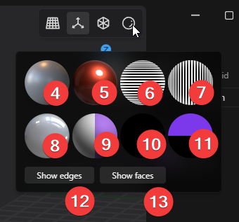

# Operating the 3D Viewport

## Operating with the Mouse

- To rotate the view: 
   - Drag with the middle mouse button (scroll wheel button).
- To pan the view: 
   - Drag with the right mouse button.
- To zoom in or out: 
   - Scroll the mouse wheel.
- To snap to orthographic projection during rotation: 
   - <kbd>Alt</kbd> + middle button drag.

Apart from the default, there are additional mouse operation modes similar to those in other applications that you can select.

1. Click on the menu located at the top left and select Preferences.

2. Click on Navigation on the left side.
3. Choose your desired operation mode. Options include:
   - Plasticity Default
   - Touchpad
   - Blender
   - Maya
   - MoI3D
   - 3ds Max
   - Fusion 360
   - Rhino
4. Click outside the dialog box to close it.
5. Close and reopen Plasticity. The changes you made to the settings will now be applied.

## Operating with Keyboard Shortcuts

### Changing the Viewing Angle

You can adjust the viewing direction using the number pad.

- Front view: <kbd>Num.1</kbd>
- Right view: <kbd>Num.3</kbd>
- Top view: <kbd>Num.7</kbd>
- Back view: <kbd>Ctrl - Num.1</kbd>
- Left view: <kbd>Ctrl - Num.3</kbd>
- Bottom view: <kbd>Ctrl - Num.7</kbd>

- Switch between perspective and orthographic projection: <kbd>Num.5</kbd>

## Focusing on a Selected Object

- To center it on the screen: <kbd>Space</kbd>
- To view it full screen: <kbd>/ (Slash)</kbd> or click the button at the bottom left of the screen.
- To  view it full screen and hide all other objects: <kbd>. (period)</kbd>

## Switching the Display Mode

- 

- To toggle overlay display: 
   - This will switch the grid display on and off.
   - <kbd>Alt - Shift - Z</kbd> or click the button(1).
- To toggle X-Ray mode: 
   - This will make hidden lines visible and selectable.
   - <kbd>Alt - Z</kbd> or click the button(2).
- To toggle Render mode
   - When switched on, Render mode will reflect the material settings.
   - Click the button(3).

 
- When Render mode is off, select the display mode by right-clicking the button(3) and choosing from the thumbnails.
   
- (4) Default
- (5) Red, glossy
- (6) Checking surface continuity, horizontal
- (7) Checking surface continuity, Vertical
- (8) Checking highlights
- (9) Matte
- (10) Checking silhouettes
- (11) No shadows

- To toggle show edges
   - Turning this off will hide the edges.
   - Click **Show Edges**(12), or use **viewport: toggle edges** in the Command Palette.
- To toggle show faces
   - Turning this off will hide the faces.
   - Click **Show faces**(13), or use **viewport: toggle faces** in the Command Palette.

