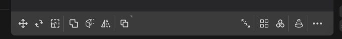
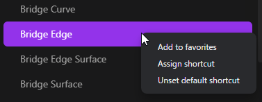

import { Callout } from 'nextra/components'

# How to Execute a Commands

In Plasticity, there are three ways to execute command: using the Command Bar, keyboard shortcuts, or the Command Palette.

## Command Bar
- The command bar is located at the bottom of the screen.

- Left side: 
   - Frequently used commands, such as move and rotate, are displayed here.
- Right side:
   - The commands displayed here depend on the selected objects.

## Keyboard Shortcuts
- Commonly used commands are assigned keyboard shortcuts. See the page for each command for specific shortcuts.

## Command Palette
- Commands that don't have buttons or shortcuts can be executed from the Command Palette. Press <kbd>F</kbd> key in the work area to display the Command Palette. Execute a command by typing its name. 
- Furthermore, you can assign shortcuts to any command or pin your favorite commands.

### Execute a Command
1. Press <kbd>F</kbd> key.
2. The Command Palette will appear.
3. Type the command name into the input field.
4. Command that match the entered words will be displayed. The options will narrow as you type.
5. Use the <kbd>Up</kbd> and <kbd>Down</kbd> arrow keys, along with the <kbd>Enter</kbd> key, to select the desired command.
6. The selected command will be executed.

### Assign a Shortcut and Add to Favorites
1. Press <kbd>F</kbd> key.
2. The Command Palette will appear.
3. Type the command name into the input field.
4. Command that match the entered words will be displayed. The options will narrow as you type.
5. Right-click on the desired command and select from the menu.

- Add to favorites
   - This will add the command to your favorites. A button will appear below the input field.
   - Furthermore, you can remove it from the right-click menu of the button.
- Assign Shortcut
   - This will assign a shortcut. When "Press a key to assign shortcut..." appears, press the key you wish to assign.
- Remove Shortcut
   - This will remove an assigned shortcut.

<Callout type="warning" emoji="⚠️">
If you assign a shortcut that's already in use, it will be overwritten without any warning message. To avoid duplication, you can combine keys like <kbd>Alt</kbd>, <kbd>Ctrl</kbd>, <kbd>Shift</kbd>, etc. when assigning shortcuts.
</Callout>

