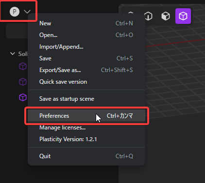

# 3Dビューポートの操作

## マウスによる操作

- ビューを回転する: 
   - マウスの中ボタン（スクロールホイール）でドラッグします。
- ビューを平行移動する: 
   - マウスの右ボタンでドラッグします。
- ビューを拡大縮小する: 
   - スクロールホイールを回転します。
- 回転中に正投影でスナップする:
   - <kbd>Alt</kbd>+マウスの中ボタンでドラッグします。

デフォルトとは別に、他のアプリケーションと同様のマウス操作モードがあります。

1. 左上のメニューをクリックし、**Preferences**を選択します。

2. 左側の**Navigation**をクリックします。
3. Choose your desired operation mode. Options include:
3. 操作モードを選びます。以下のオプションがあります。
   - Plasticity Default
   - Touchpad
   - Blender
   - Maya
   - MoI3D
   - 3ds Max
   - Fusion 360
   - Rhino
4. ダイアログボックスの外側をクリックして閉じます。
5. Plasticityを閉じ、再度開きます。これで設定に加えた変更が適用されます。

## キーボードショートカットによる操作

### ビューのアングルを変える

テンキーでビューの方向を調整できます。

- 前から: <kbd>Num.1</kbd>
- 右から: <kbd>Num.3</kbd>
- 上から: <kbd>Num.7</kbd>
- 後ろから: <kbd>Ctrl - Num.1</kbd>
- 左から: <kbd>Ctrl - Num.3</kbd>
- 下から: <kbd>Ctrl - Num.7</kbd>

- 透視投影と正投影を切り替える： <kbd>Num.5</kbd>

## 選択したオブジェクトに焦点を合わせる

- 画面の中央に表示する: <kbd>Space</kbd>
- 画面全体に表示する: <kbd>/ (Slash)</kbd> or click the button at the bottom left of the screen.
- 画面全体に表示して、他のオブジェクトを隠す: <kbd>. (period)</kbd>

## ディスプレイモードを切り替える

- 

- オーバーレイを切り替える:
   - グリッドの表示が切り替わります。
   - <kbd>Alt - Shift - Z</kbd> またはボタン(1)をクリックします。
- X-Rayを切り替える:
   - 隠れているエッジやカーブを表示し、選択できるようにします。
   - <kbd>Alt - Z</kbd> またはボタン(2)をクリックします。
- レンダーモードを切り替える:
   - オンにするとマテリアル設定を反映した表示になります。
   - ボタン(3)をクリックします。

 
- レンダーモードがオフの場合は、ボタン(3)を右クリックして表示されたサムネールから表示モードを選択できます。
   
- (4) デフォルト
- (5) 赤い光沢のある表示
- (6) サーフェイスの連続性を確認できます（水平方向）
- (7) サーフェイスの連続性を確認できます（垂直方向）
- (8) ハイライトを確認できます
- (9) マットな表示にします
- (10) シルエットを確認できます
- (11) 影のない表示にします

- エッジを表示する/しないを切り替える
   - **Show Edges**(12)をクリックするか、コマンドパレットで**viewport: toggle edges**を実行します。
- To toggle show faces
- フェイスを表示する/しないを切り替える
   - **Show faces**(13)をクリックするか、コマンドパレットで**viewport: toggle faces**を実行します。

