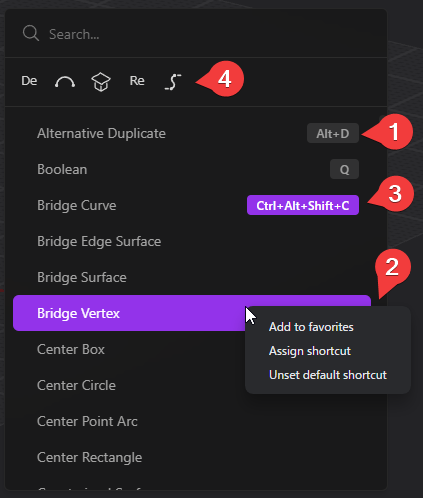

# 作業環境をカスタマイズする　（未）

## 基本設定する

メニュー > Preferences

### Navigation

### Preferences

### Appearance

### Grid & Unit

### Backup

## ショートカットとお気に入りの登録

作業エリア内で`F`キーを押すとコマンドパレットが表示されます。

1. デフォルトのショートカット（グレーの文字）
2. 右クリックメニュー
    - お気に入りへの登録
    - ショートカットを登録する
    - デフォルトのショートカットに戻す
3. 登録したショートカット（紫色）
4. お気に入りに登録した機能
