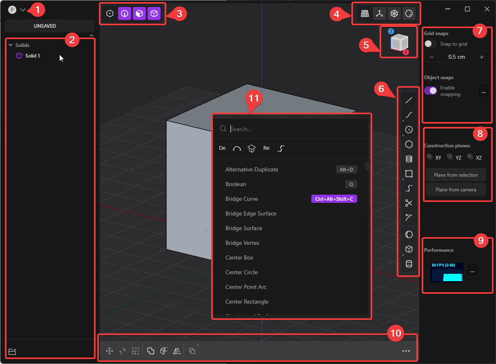
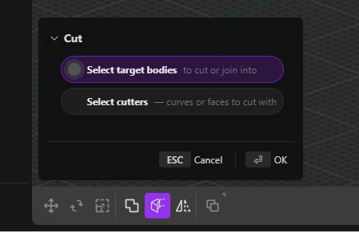

# Overview of the Interface

1. Menu
2. Outliner
3. Selection mode
4. View mode
5. View cube
6. Tool
7. Snap mode
8. Construction Plane mode
9. Detail Display Area
10. Command Bar
11. Command Palette

## How to Confirm Commands

Right-click or press OK in the Command Dialogue.

Example: Command Dialogue for 'Cut' command.

